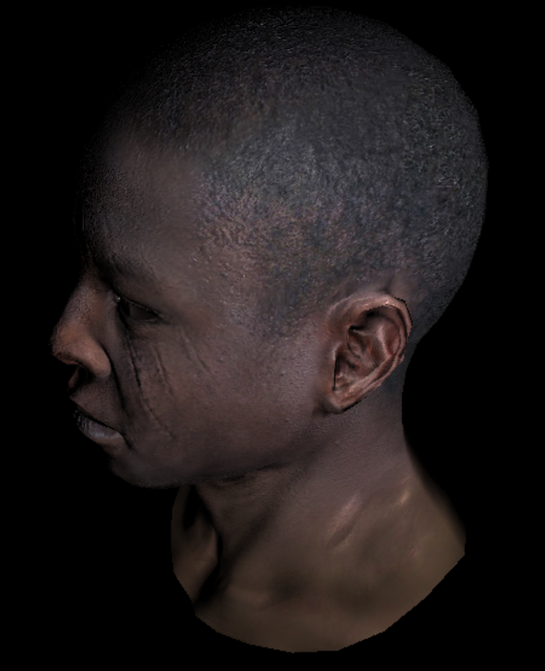
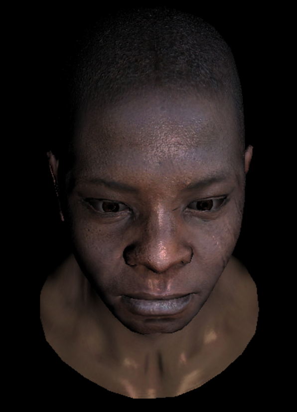
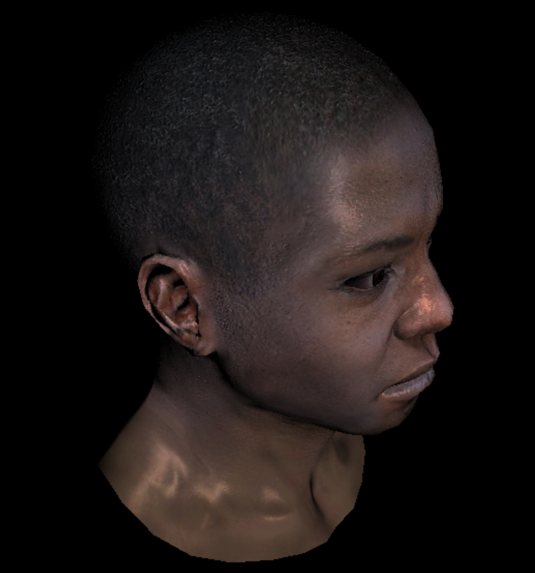
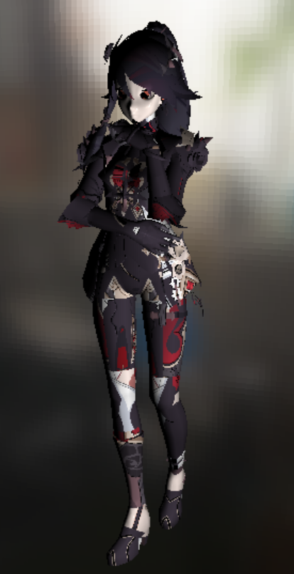
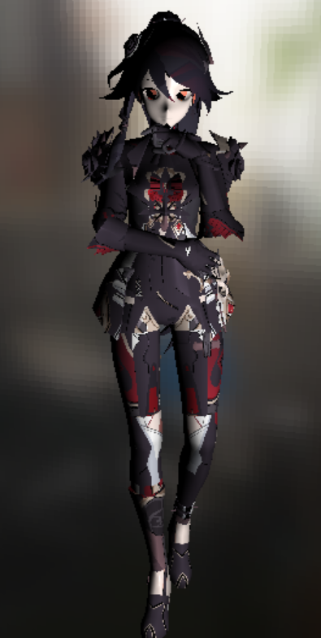
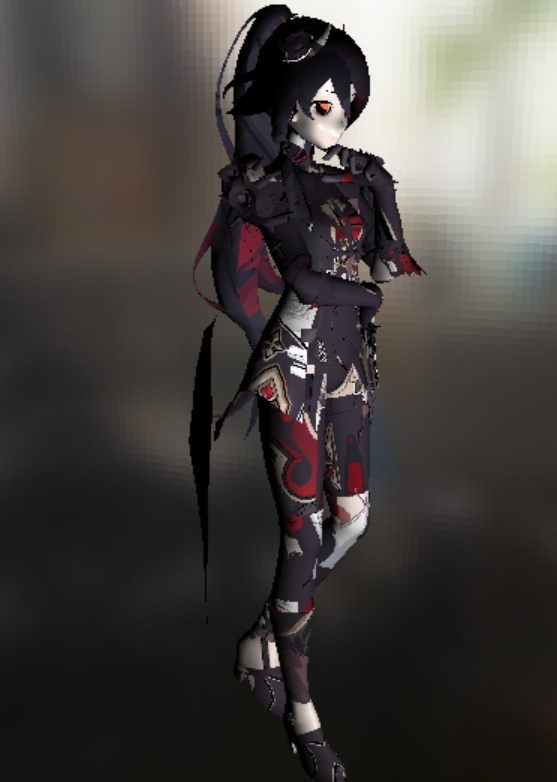
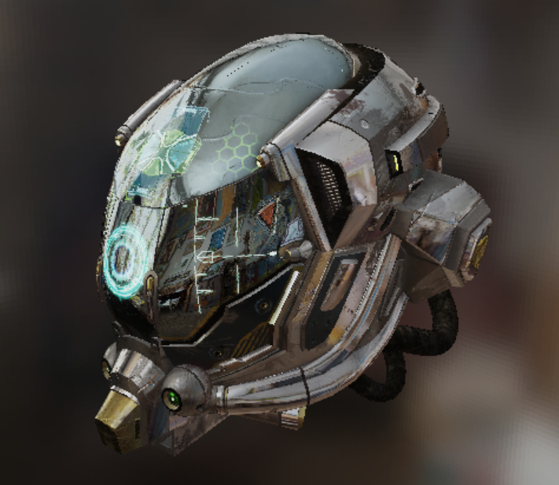
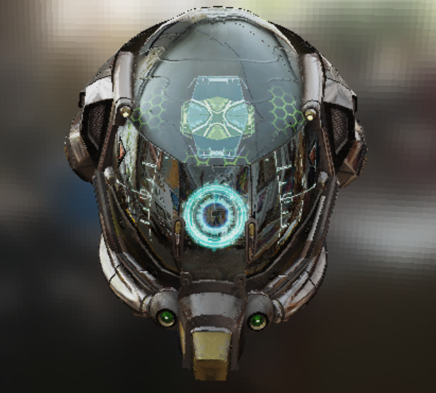
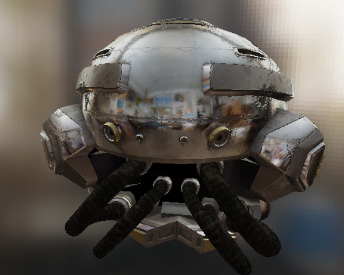
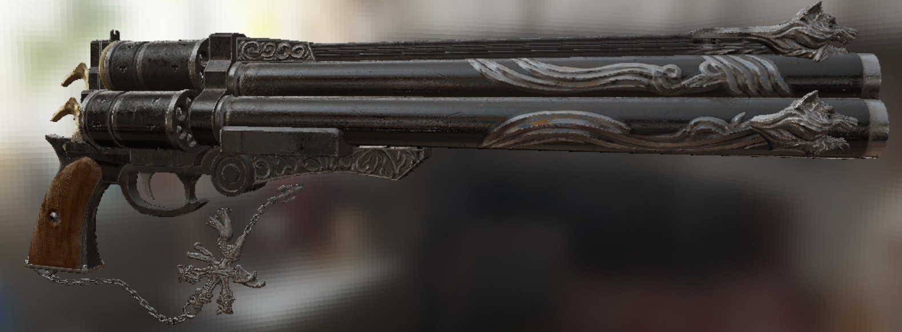

# MyTinyRenderer

This is a software rasterization application written by C++. 

The most of design details are based on [ssloy's tinyrenderer](https://github.com/ssloy/tinyrenderer/wiki) and [Games101](https://sites.cs.ucsb.edu/~lingqi/teaching/games101.html)

# Dependence

* glm
* windows API
# Main Features

* CMake
* Bling-Phong shading
* Perspective correct interpolation
* Back-face culling
* Movable camera
* Tangent space normal mapping
* Skybox
* Physicallly-Based Rendering
* Image_Based Lighting
# Build

## Linux

```powershell
cd /path/to/tinyrender
mkdir build
cd build
cmake ..
make
```
## Windows

```powershell
cd /path/to/tinyrender
mkdir build
cd build
cmake -G "Visual Studio 16 2019" ..
click SoftRenderer.sln && build all
```
# Controls

* Orbit: left mouse button
* Pan: right mouse button
* move: WASD
# Screenshots
## Gouraud Shading
| </img> | </img>|</img>|
| ------ | ------ | ------ |
| </img> | </img>|</img>|

## Image_Based Lighting
| </img> | </img>|</img>|
| ------ | ------ | ------ |

</img>